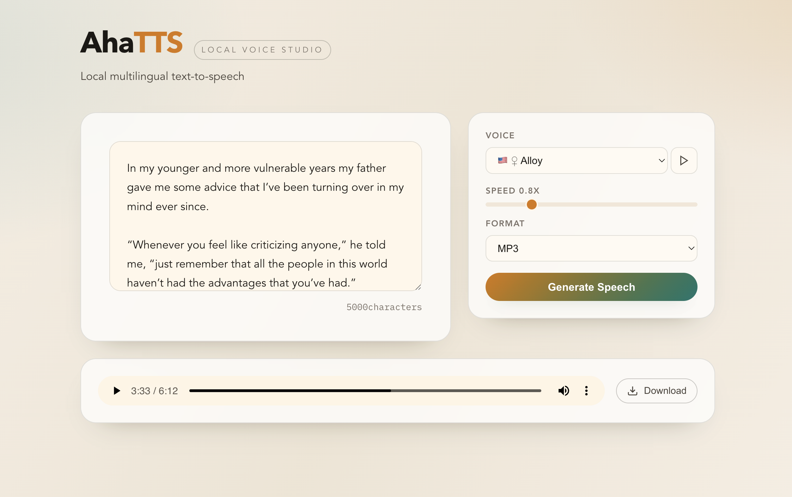

# AhaTTS

<p align="center">
  <a href="https://github.com/IHKYoung/AhaTTS/commits/main"></a>
  <a href="LICENSE"></a>
  
  
  
</p>

<p align="center">
  <strong>语言：</strong> <a href="README.zh-CN.md">简体中文</a> | <a href="README.md">English</a>
</p>

AhaTTS 是开源、轻部署的语音合成服务，提供 OpenAI 兼容 API 与内置 Web 演示页面。

<p align="center">
  
</p>

## 亮点
- OpenAI 兼容 API，便于集成
- 内置 `api/web` 演示页面
- CPU / CUDA / MPS 支持
- 多语言与多音色（Kokoro）
- 流式输出与高质量音频

## 快速开始
```bash
./scripts/install.sh --device cpu   # 或 gpu / mac
./scripts/dev.sh
```

访问：
- http://localhost:25288/docs
- http://localhost:25288/web/

## OpenAI 语音生成 API
请求地址：`http(s)://<server-address>:<port>/v1/audio/speech`（POST）。

参数说明：
- `model`（string，必需）：可用的 TTS 模型之一：`tts-1` 或 `tts-1-hd`。
- `input`（string，必需）：要生成音频的文本，最大长度 4096 个字符。
- `voice`（string，必需）：可用的语音：`alloy`、`ash`、`coral`、`echo`、`fable`、`onyx`、`nova`、`sage`、`shimmer`。
- `response_format`（string，可选）：音频格式，默认 `mp3`。支持：`mp3`、`opus`、`aac`、`flac`。
- `speed`（number，可选）：生成音频速度，默认 `1.0`。可选范围 `0.5` 到 `2.0`。
